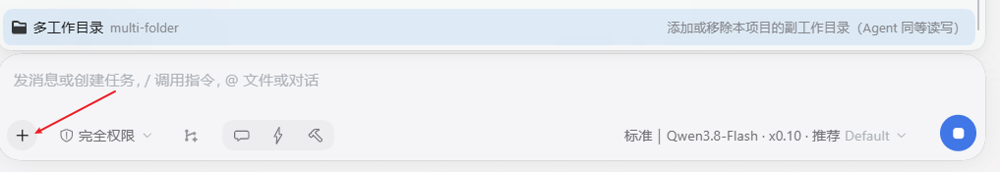
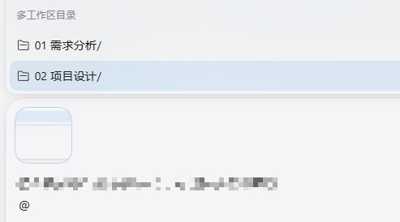

# dsh-multi-folder

**English** | [中文](README.zh.md)

> Secondary working directories for one DSH project: the agent's primary workspace stays put, while configured secondary directories get equal read/write/execute rights and are reachable with `@` in the input.

## What you get

| Situation | Behavior |
| --- | --- |
| Composer **"+"** menu | A **Multi-folder** row in its Commands group — listed whether or not the draft has text; picking it opens the **shell's own option picker** (the same surface behind the model selector) |
| Picker: add | First row "Add working directory" → native directory picker; re-adding the same path keeps a single entry and says so; add several in a row |
| Picker: remove | One row per configured directory → a **two-step confirmation** (tick to acknowledge, then Remove; Cancel returns to the list) |
| Typing **`@`** | Files inside the secondary directories appear as their own group; the picked path is inserted absolute, so the agent can `read` it directly |
| In a session | The directory list is injected into the system prompt; config changes reach the agent at the next message or tool-call boundary, **without interrupting** |
| Other windows / hand edits | Config lives in a host-owned store and reads are version-checked against the file, so a change made in another window — or by editing the JSON directly — is picked up on the **next read, no restart** |
| Writing files / running commands | `write` / `edit` / `pwsh` / `bash` landing in a secondary directory are re-rooted to it automatically; every sandbox mode keeps its semantics. `read` / `glob` / `grep` are unrestricted anyway |

## Showcases

**The "+" menu entry** — a `Multi-folder` row inside the composer's own menu, with a localized label, a folder glyph and a one-line description:



**`@` references** — the configured secondary directories listed under their own group while typing `@`:



Slash command (same capability, also what the agent sees):

```
/multi-folder list
/multi-folder add "D:\path\to\repo"
/multi-folder remove "D:\path\to\repo"
/multi-folder set "D:\a" "D:\b"
```

## Install

```bash
dsh plugin --profile web add @zfgcta/dsh-multi-folder
```

Where GitHub is hard to reach from, the npm registry route above is the one to use; a git or local source also works:

```bash
dsh plugin --profile web add git+https://github.com/HelloQingTao/dsh-multi-folder.git
dsh plugin --profile web add file:D:/projects/dsh-multi-folder   # local clone, forward slashes
```

Afterwards **restart the DSH backend** (host plugins are composed at process start) and **refresh the browser page** (the client bundle is served fresh). Remove with `dsh plugin --profile web remove @zfgcta/dsh-multi-folder`.

## Requirements

- Node.js >= 20
- A DSH profile composed from `@deepseek-ai/dsh-base` + `@deepseek-ai/dsh-web-app` (the standard web profile)
- No build step: the host half is plain ESM, `lib/client.js` is a hand-maintained factory bundle in the DSH client-modules format

## DSH compatibility

| DeepSeek Harness | Support |
| --- | --- |
| **0.1.7 and later** | ✅ Full support: "+"-menu picker, `@` references into secondary directories, cross-window config coherence (verified on 0.1.7-rc.2) |
| 0.1.6 and earlier | ❌ Not supported |

The "+"-menu picker and `@` references build on the `commandUi` / `inputTriggers` client services shipped from 0.1.7; on older hosts those services are absent — the plugin skips just those registrations instead of erroring, but the two features are unavailable.

Install this package and the upstream `dsh-multi-folder` **one at a time**: they claim the same runtime namespace, so having both in a profile breaks one of them. Uninstall the other first (`dsh plugin --profile web remove <package>`).

## How it works

- **Sandbox re-rooting** — a listener on the `tools/execute` around-dispatch waterfall intercepts `write` / `edit` / `pwsh` / `bash` calls whose resolved path (or `workdir`) falls inside a configured directory and runs them with the session's standing policy **re-rooted** to that directory (`{ ...standing, workspaceRoot: dir }`). The mode itself is untouched, so `read-only` still denies and `workspace-write` still allows. Paths go through `fs.resolve` + `processPath` before matching, so `..`, symlinks and case differences behave. Background runs (`run_in_background: true`) register with the generic jobs runtime under the same re-rooted policy, so `job_output` / `job_kill` keep working.
- **One writable root** — the Windows ACL runner grants each process tree a **single** writable root, so a command that stays in the primary workspace cannot create files in a secondary directory (`git -C <dir>`, or `cd` inside a script, fails with an OS-level `Permission denied`). **File-creating commands must pass `workdir` set to the directory they write into, as an absolute path**; when a failure matches this pattern the plugin appends the fix to the tool result.
- **The "+"-menu entry** — the host registers `/multi-folder` with the human-command registry, which is what feeds the shipped menu's Commands group. Two things matter: ① the command deliberately declares **no `input.hint`**, because the shipped group hides hinted rows once the draft is non-empty, and this row must always be present (the handler still parses `rawInput`, so `add <path>` keeps working by hand); ② the client hangs a `popupSelect` spec on that same host command via `ctx.commandUi.decorate`, so a pick opens the **shell's own picker** instead of inserting a bare command line. The plugin supplies only data — rows, labels, and the `confirmation` shape — and **never draws a popup of its own**.
- **`@` references** — `ctx.inputTriggers.registerSource` adds a second `@`-trigger source (same trigger, distinct `name`, so it coexists with the shipped source as its own group) that asks the host's `multiFolder/listFiles` endpoint for each directory's direct children and returns absolute paths. The whole body is guarded and capped at 30 rows; per the pipeline's `source-failed` semantics a failure drops only this group.
- **Configuration and security boundary** — per-workspace config is a JSON array in a host-owned store **outside every agent sandbox root** (`<DSH_HOME>/storages/multi-folder/<workspace-key>.json`); direct `write`/`edit` attempts against it are rejected with an explicit message — **the agent can never self-grant a directory; configuration is user-managed by design**. The in-process cache is kept honest with `fs.stat`: a cached copy is reused only while the file still reports the version it was read at (stamped *before* the read, so a racing write can't leave older content cached under a newer stamp); every read normalizes and de-duplicates. See [SECURITY.md](SECURITY.md).
- **Sessionless remote API** — the `multiFolder` namespace is registered through `ctx.typert.register` with hand-written `src-json` descriptors and provided as a plain-object service. `list` / `add` / `remove` / `set` / `listFiles` are keyed by workspace **path** and share one validated core with the command, so the new-session screen can configure directories before any session exists.

## Development & docs

- Tests: `node test/smoke-host.mjs` (host apply + remote API + cache coherence + `listFiles`), `node test/intercept.mjs` (interception / command / notification)
- Architecture: [docs/design.md](docs/design.md) · Security model: [SECURITY.md](SECURITY.md) · Changes: [CHANGELOG.md](CHANGELOG.md)

## License

[MIT](LICENSE)
